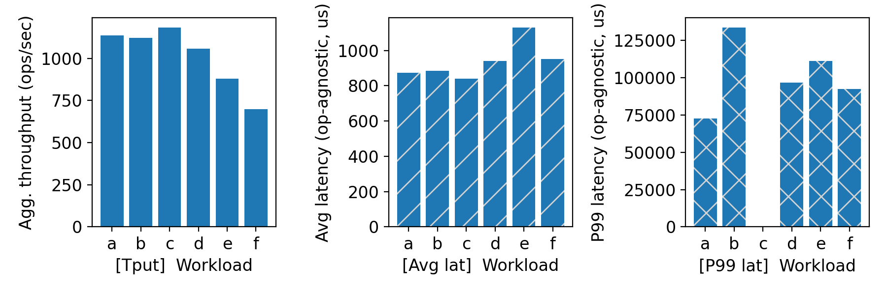
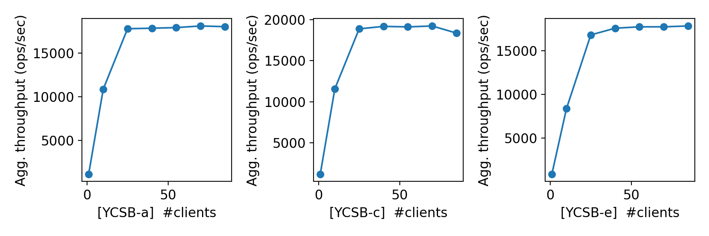
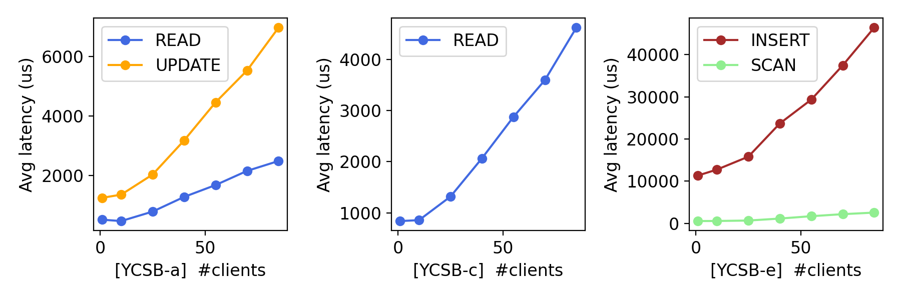

# CS 739 MadKV Project 1

| **Group Members** | **Name**       | **Email**                     |
|-------------------|----------------|-------------------------------|
| **Member 1**      | Smit Shah      | spshah25@wisc.edu             |
| **Member 2**      | Srihari Sridharan      | srihari.sridharan@wisc.edu  

## Design Walkthrough

### Code Structure
  
- **`impl/`**: Implements core server and client functionalities in `clientimpl.cc`, `serverimpl.cc`. It also includes CMake files for build management and generated files related to gRPC protocol buffers. It interacts with gRPC for communication between components and includes essential protobuf files that define the data structure and API.
#### `impl/` Folder Structure

The `impl/` folder is where the core functionality of the project is implemented containing the following files: 

1. **`clientimpl.cc`**:
   - Implements the client-side logic for interacting with the key-value store.
   - Contains functions for sending requests (such as `Put`, `Get`, `Swap`, etc.) to the server via gRPC.
   
2. **`serverimpl.cc`**:
   - Contains the server-side implementation.
   - Handles incoming client requests, processes them (e.g., retrieving data, inserting data, etc.), and sends back appropriate responses.

3. **`generated/`**:
   - Contains generated files for gRPC and Protocol Buffers (`kvstore.grpc.pb.cc`, `kvstore.pb.cc`, etc.), which are essential for communication between the client and server.
   - These files are automatically generated from the `kvstore.proto` file, which defines the gRPC service and message structures.

4. **`protos/`**:
   - Contains the `kvstore.proto` file, which defines the gRPC service and message structures for the key-value store.
   - The `proto` file is essential for defining the API contract between the client and server.

5. **`CMakeLists.txt`**:
   - Configures how the CMake build system should compile the project.
   - Handles dependencies and ensures that the correct libraries (like gRPC and Protocol Buffers) are linked.

6. **`cmake/`**:
   - This directory is responsible for managing the build configuration using CMake.
   - **`build/`**: Contains all the files related to the build process, including intermediate files, generated binaries, and object files.
     - **`clientimpl.cc.o`**: Compiled object file for the client implementation.
     - **`serverimpl.cc.o`**: Compiled object file for the server implementation.
     - **`CMakeCache.txt` and `CMakeFiles/`**: Configuration files and metadata for CMake.
  - **`common.cmake`**:  Includes shared configuration settings for building different components.

Apart from the `impl` folder, the below folders are also present in the main diorectory.
- **`justmod/`**: Includes configuration files for `just` task automation (`proj1.just`, `utils.just`), simplifying workflow tasks.

- **`metrics-using-string-types/`**: Contains benchmark logs and related plot files for performance evaluation for all RPC messages as strings to give a comprehensive comparison with bytes.

- **`metrics-using-optimized-protobuf-types/`**: Contains benchmark logs and related plot files for performance evaluation for all RPC messages as bytes and minimal use of gRPC data structures.

- **`tests/`**: Stores student generated test cases, including specific test data for different scenarios.

This organization ensures clear separation of concerns and efficient handling of different components like implementation, benchmarks, reports, and tests.

### Server Design
#### Summary of `serverimpl.cc`  

The provided gRPC server implementation defines a simple **key-value store** using an **in-memory `std::map`** to manage key-value pairs. The server is **single-threaded** and listens on a **configurable port**, which can be specified via command-line arguments. The service exposes the following RPC methods:

1. **PutKey** – Inserts or updates a key-value pair. Returns `true` if the key existed before.
2. **SwapKey** – Updates the value of a key and returns the previous value. Returns `"null"` if the key did not exist.
3. **GetKey** – Retrieves the value for a given key. Returns `"null"` if the key is not found.
4. **ScanKey** – Retrieves key-value pairs in a specified range (`startKey` to `endKey`).
5. **DeleteKey** – Removes a key from the store and returns success status.

---

### Key Implementation Details  

#### **1. In-Memory Data Structure**
- The key-value store is **in-memory**, meaning all data is stored in RAM and lost upon restart.
- It uses `std::map`, which maintains keys in **sorted order**, allowing for efficient range queries.

#### **2. Parameters Passed to Each RPC Method**
Each method receives three key parameters:
- **`ServerContext* context`** – Provides per-call information (e.g., authentication, metadata).
- **`const KeyValueRequest* request`** – Contains the request data (key and value).
- **`KeyValueResponse* reply`** (or `ScanKeyValueResponse* reply` for Scan operation) – Holds the response data.

### RPC Protocol Overview 

The **KeyValueStore** service follows a **request-response** RPC model where clients interact with the server using **gRPC**. The protocol supports **basic key-value operations** over an **in-memory, single-threaded store**.  

#### **1. Protocol Characteristics**  
- Uses **`bytes`** for keys and values to avoid **UTF-8 overhead**.  
- Uses a boolean variable in responses to indicate the presence / absence of values for sending less data over the network and **maximizing bandwidth**.  
- **Single-threaded** - Requests are handled sequentially.  
- **Highly reusable** gRPC data structures with minimum request message types and response types, leading to lower overhead and processing.
- **`ScanKeyValueResponse` is a single string** since, based on our understanding, real-time streaming is not required.

---

#### **2. RPC Communication Flow**  
Each operation follows a **client-server exchange pattern**, where:  
- The client **sends a request** (with key and optional value).  
- The server **processes the request** and returns a structured response.  

---

#### **3. RPC Methods & Message Exchange**  

#### a. **PutKey (Insert/Update a Key)**
- **Client Request:**  
  - `key` (bytes)  
  - `value` (optional bytes)  
- **Server Response:**  
  - `success` (bool) - `true` if key existed, `false` otherwise  

 **Use Case:** Insert a new key or update an existing key’s value.  

---

#### b. **SwapKey (Atomic Key Update with Previous Value)**
- **Client Request:**  
  - `key` (bytes)  
  - `value` (optional bytes) - New value to replace the old one  
- **Server Response:**  
  - `success` (bool) - `true` if key existed, `false` otherwise  
  - `value` (optional bytes) - Previous value (if key existed)  

---

#### c. **GetKey (Retrieve a Value by Key)**
- **Client Request:**  
  - `key` (bytes)  
- **Server Response:**  
  - `success` (bool) - `true` if key exists, `false` otherwise  
  - `value` (optional bytes) - Fetched value if key exists  

---

#### d. **ScanKey (Range Query over Ordered Keys)**
- **Client Request:**  
  - `key` (bytes) - Start of the scan range  
  - `value` (optional bytes) - End of the scan range  
- **Server Response:**  
  - `message` (string) - Formatted list of key-value pairs in the range  

---

#### e. **DeleteKey (Remove a Key)**
- **Client Request:**  
  - `key` (bytes)  
- **Server Response:**  
  - `success` (bool) - `true` if key was deleted, `false` otherwise  
---

## Self-provided Testcases

Below is the **robustness testing table** covering the test cases for a **single client** interacting with the key-value store.  

| **Test Case #** | **Operation** | **Description** | **Expected Behavior** | **Coverage** |
|---|---|---|---|---|
| **1** | Scan | `startKey > endKey` | Returns an empty result or an error | Edge case handling of range queries |
| **2** | Scan | Neither start nor end key exists | Returns an empty scan response | Handling of missing keys in range queries |
| **3** | Scan | Only one of start/end key exists | Returns partial results from the existing key onwards | Partial range query handling |
| **4** | Scan | `startKey == endKey` | Returns that single key if it exists, else empty | Ensures correct boundary case behavior |
|**5** | Linearizability | >2 concurrent clients are operating. | Linearizability of operations are expected. | Single threaded nature of server is covered and consistency model is as expected. |
| **6** | Put/Get | Keys/values are purely numeric | Should behave normally, store and retrieve as expected | Checks handling of numeric keys/values |
| **7** | Delete | Key does not exist | Returns `success = false` | Proper handling of deletion for missing keys |
| **8** | Delete + Get | Delete a key and then attempt to Get it | `Get` should return `null` or `success = false` | Ensures proper deletion and cleanup |
| **9** | Delete + Get | A prefix/suffix of the deleted key is present | Prefix/suffix should still exist unaffected | Ensures selective deletion |
| **10** | Get | Request for a missing key | Should return `null` or `success = false` | Correct handling of absent keys |
| **11** | Get | Request for an existing key | Should return stored value with `success = true` | Ensures data retrieval is correct |
| **12** | Get | Key is `null` | Treat the string `null` as the key to get. | Edge case handling for unexpected input. |
| **13** | Put | Key with value `"null"` | Should store `"null"` as a valid value | Ensures "null" is treated as a valid string |
| **14** | STOP | Disconnects a client from the server. | Command should stop and exit and no commands entered after this shall be processed. | Ensures clients are disconnected. |
| **15** | Swap | Swap a key that doesn’t exist | Should add key with new value, return `success = false` | Ensures correct behavior for missing keys |
| **16** | Swap | Swap an existing key | Should replace value and return old value with `success = true` | Ensures correct swapping functionality |
| **17** | Swap | Swap a `null` key | Treat the string `null` as a key. | Ensures robustness against null keys |

This table ensures **comprehensive test coverage**, validating:
- **Edge cases**
- **Error handling**
- **Correctness of operations** 
- **Data integrity and constraints** 

<u>Found the following testcase results:</u> 1, 2, 3, 4, 5

### **Summary of Test Recipes for Key-Value Store**  

These test recipes define **five test scenarios** for validating the Key-Value Store server. They involve both **single-client** and **multi-client (concurrent) tests**, including cases with **conflicting operations**. All the above scenarios are covered in the following test cases.

---

### **1️ Single Client, 2 Cases**  
 **Covered in Test Cases: `test1`, `test2`**  

| **Test Case** | **Description** | **Execution** |
|--------------|----------------|---------------|
| **`test1`** | Runs a single client with test file `test1.txt`. Verifies that the file exists before execution. | Runs `check_file_exists` and then a single client request on numerical keys. |
| **`test2`** | Runs a single client with test file `test2.txt`. Ensures the file exists before running. | Similar to `test1`, but with a different input file for alphanumeric keys. |

**Purpose:** Validate the server’s behavior with a single client under different test inputs.

---

### **2️ Concurrent Clients, No Conflicts, 1 Case**  
 **Covered in Test Case: `test3`**  

| **Test Case** | **Description** | **Execution** |
|--------------|----------------|---------------|
| **`test3`** | Runs two **non-conflicting** clients (`test1.txt` and `test2.txt`) concurrently. | Both clients execute simultaneously, and `wait` ensures completion. |

**Purpose:** Ensure **concurrent reads/writes** work correctly when operations do not interfere.

---

### **Multiple Concurrent Interfering Clients, 2 Cases**  
**Covered in Test Cases: `test4`, `test5`**  

| **Test Case** | **Description** | **Execution** |
|--------------|----------------|---------------|
| **`test4`** | Runs two clients (`test2_conflicting.txt` and `test2.txt`) **simultaneously**. They may modify overlapping keys. | Ensures both files exist and executes clients concurrently. |
| **`test5`** | Runs two clients (`test1_conflicting.txt` and `test1.txt`) with possible key conflicts. | Similar setup as `test4`, but different test data. |

**Purpose:** Validate **race conditions and consistency** when multiple clients perform overlapping operations.

---

### **Test Coverage Overview**  

| **Scenario** | **Test Cases** | **Clients** | **Conflicts?** | **Expected Outcome** |
|-------------|--------------|----------|------------|----------------|
| **Single Client, 2 Cases** | `test1`, `test2` | 1 per test |  No | Server handles single requests correctly. |
| **Concurrent Clients, No Conflicts, 1 Case** | `test3` | 2 |  No | Concurrent execution works correctly. |
| **Concurrent Interfering Clients, 2 Cases** | `test4`, `test5` | >2 |  Yes | Detects race conditions and ensures correctness. |

## Fuzz Testing

<u>Parsed the following fuzz testing results:</u>

num_clis | conflict | outcome
:-: | :-: | :-:
1 | no | PASSED
3 | no | PASSED
3 | yes | PASSED

### Comments

Our fuzz testing has consistently produced correct outcomes. However, during the development cycle, we encountered intermittent failures with concurrent clients, including segmentation faults, channel timeouts due to incorrect output formats, and issues with UTF data transmission. Unfortunately, the error messages have not always been helpful in pinpointing the exact line of code or providing a clear stack trace.  

Debugging concurrent issues using GDB proved challenging, often leading to confusion and consuming significant time. At times, our current implementation still faces these issues, making them potential Heisenbugs. In practice, rerunning the test cases multiple times (typically 2-3 attempts) has generally led to a **PASSED** status.  

Since we do not have complete visibility into how the Rust-based fuzz tests are created and executed, adding debug statements and tracing the flow of execution has been difficult. The learning curve for debugging Rust proved to be steep, and given time constraints, we opted to focus on rerunning the service and client rather than diving deep into Rust debugging. Additional logging in the test cases would have significantly improved visibility and troubleshooting.

## YCSB Benchmarking

<u>Single-client throughput/latency across workloads:</u>

<u>Agg. throughput trend vs. number of clients:</u>

<u>Avg. & P99 latency trend vs. number of clients:</u>

### Comments

We observe that in workload A, updates are always costlier than reads. This is likely due to the additional memory allocation and the lookup + entry in the internal Red-Black Tree maintained by the map.

Another thing that we noted is that the average latency increases with the count of clients. This overhead is likely to be caused by the context switching incurred due to the multiple clients.

We were pondering why the average latency for reads varies drastically across workloads A and C.

From the graph depicting the trends in the throughput with a variable number of clients, we see that the server's throughput saturates beyond 40 clients across the workloads A, C and E. With a further increase in the number of clients that the server needs to handle, the number of operations it needs to serve increases. However, the number of operations it is capable of serving is capped. This explains the linear increase in the latency observed for the workloads A, C and E with 40+ clients. However, we also noted that the aggregate throughput is higher for workload C (~20000 ops/s) compared to the workloads A and E with higher number of clients. This is because writes are costlier than reads. 

For the comparison between Insert and Scan, insert Involves heapification and takes more time. The processor has to spend time allocating memory, finding the correct position in the Red Black Tree and then write the new value. Hence, write is the costliest operation.

When we see the graphs for a single client, we observe that workload E has the highest average latency. Although the difference is not significant after accounting for law of averages, our belief is that the peak is because of I/O for scans and the costly insert operations. It beats us then as how scans are less costlier as compared to reads for workloads a,c and e. Maybe the key range and distribution of randomly generated keys can be a possible reason.

For a single client, throughput is minimum for workload F. Workload F involves reading, modifying and writing back to the client as one operation. Although these are 3 operations in total, if we count three operations as one, the total number of operations per second is going to decrease.

Moving on, the average latency for workload E is higher marginally as compared to other workloads because of insertion. We believe insertion is a bottleneck for a processor as it has to allocate contiguous block of memory and context switch.

P99 latency for workload B is higher because one off updates would have caused the processor to reallocate memory.

## Additional Optimizations

When we first designed our gRPC-based Key-Value Store, we used strings as the primary data type for keys and values. This approach seemed natural since gRPC's string type supports human-readable text, making debugging easier. However, as we expanded our implementation and analyzed the system’s performance, we noticed inefficiencies, particularly in data serialization and network transmission.

### Step 1: Optimizing Data Structures – Moving from Strings to Bytes

One of the first improvements we made was switching from strings to bytes in our Protocol Buffers (proto3) definitions. This change was driven by the realization that strings in gRPC enforce UTF-8 encoding, which introduces unnecessary validation overhead. 

### Step 2: Evaluating Streaming – Why We Decided Against It

Another area we explored was gRPC streaming for batch operations like ScanKey. The idea was to stream large sets of key-value pairs in chunks instead of returning a single, concatenated response. This would have been beneficial for reducing memory pressure and improving responsiveness.

However, after analyzing our server architecture, we concluded that streaming wasn't necessary. Since our server was single-threaded, all requests were already handled sequentially, meaning there was no benefit in streaming results incrementally. Additionally, our batch operations were already well-optimized, and introducing streaming would have added complexity without significant gains. As a result, we decided to keep batch operations simple, returning a single structured response instead of using server-side streaming.

Through incremental optimizations, we transformed our system into a leaner, more efficient gRPC service. By switching from strings to bytes, we reduced encoding overhead and improved serialization performance. Finally, by analyzing streaming requirements, we made an informed decision to keep batch operations simple, avoiding unnecessary architectural complexity.

This experience reinforced the importance of continuous profiling and optimization, ensuring that every change is backed by measurable performance improvements. While there’s always room for further enhancements, these optimizations have helped us build a more scalable and efficient system, balancing simplicity with performance.

### Bottleneck Analysis and Future Work

Our analysis of execution times for key-value store operations reveals that the server-side processing of operations (Put, Swap, Get, Delete, and Scan) contributes only ~2% of the total round-trip time. This indicates that the network latency dominates the overall response time, rather than the efficiency of the in-memory map implementation on the server.

|  |
|:--:|
| *Average Execution time of the individual operations at the Server.* |

From the graph above, we observe that execution times on the server remain consistently low, with minimal variance across different operations. However, the second graph shown below, which measures the full round-trip time, indicates the significant overhead—exceeding hundreds of microseconds. This suggests that network transmission, including request serialization, transport, and deserialization, is the primary bottleneck.

Our future optimizations would focus on reducing network latency, possibly through techniques like request batching and compression.

||
|:--:|
| *Average Round Trip Execution time of the individual operations.* |

