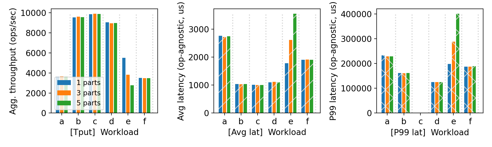
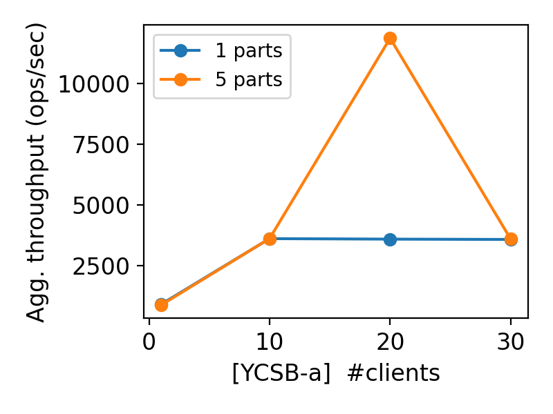

# CS 739 MadKV Project 2

| **Group Members** | **Name**       | **Email**                     |
|-------------------|----------------|-------------------------------|
| **Member 1**      | Smit Shah      | spshah25@wisc.edu             |
| **Member 2**      | Srihari Sridharan      | srihari.sridharan@wisc.edu  

## Design Walkthrough

**Cluster Manager**

### Network Topology
Due to resource constraints on CloudLab, our cluster setup is structured such that all components—including servers, the cluster manager, and clients—are executed as separate processes within the same node. While this setup deviates from a distributed multi-node architecture, it allows us to simulate and test our system's behavior effectively without needing additional physical or virtual machines. This design choice ensures that we can evaluate the cluster’s coordination and request handling while adhering to the limitations of our testbed environment.

### Cluster Manager Interactions
The cluster manager (CM) is responsible for handling interactions between clients (C) and servers. The interaction flow follows a structured process:
- **Server Registration:** Servers must register with the cluster manager upon initialization. Only after all servers are successfully registered does the manager expose server details to clients.
- **Client Requests:** Clients contact the cluster manager to obtain server details before sending their requests. This ensures that clients only interact with fully initialized and registered servers.
- **Retry Mechanisms:** Retries occur in multiple interactions:     - Client to Cluster Manager (CM): Clients retry requests to the CM if they fail to receive server details.     - Client to Server: Clients retry requests to servers in case of failures.     - Server to CM: Servers retry registration attempts with the CM until successful.     - Tracking Mechanism: The CM maintains a boolean tracker to monitor server registration status and ensure all servers are properly registered before responding to clients.     - Retry Interval: The retry interval is currently configured as 3 seconds to balance responsiveness and avoid excessive load.

### Partitioning with SDBM Hash

We considered adopting a static partitioning, SHA-256, FNV-1 and SDBM hash algorithms to determine the partitioning of keys. however, we chose the SDBM hash due to the following advantages it provides over the others:

SDBM has a simple implementation using bitwise shifts and additions, making it easier to integrate compared to SHA-256, which requires complex cryptographic operations. It is significantly faster than SHA-256 due to its lightweight computation and also performs better than FNV-1 due to its efficient bitwise transformations. SDBM offers a balanced approach with better key distribution than FNV-1 and avoids clustering issues seen in static partitioning. SDBM is well-suited for distributed key-value stores, ensuring efficient key distribution and fast lookups without the overhead of cryptographic hashing or the imbalance of static partitioning.

### Database Management
The database utilized by the cluster manager is local to the node. This simplifies deployment but requires careful handling of data repopulation in case of failures. To ensure consistent key mappings, we employ a hashing mechanism that determines the target server for each key. The **sdbm** hash function is used, with additional microbenchmarking to evaluate its effectiveness. Specifically, we analyze the first ten and last ten hash values to assess distribution quality. Additionally, we implement **consistent hashing** to provide resilience against server churn and improve load balancing.

We initially went with one database across all servers as the source of truth for all state commands. After discussion with TA,
we realized that the expectation for the assignment is not that. You are very welcome (and recommended) to incorporate your favorite local storage library, 
As per this line in the assignment specification, we must have a local DB for each server and not a single DB local to the cluster.
Also, if we go with a single database for all servers, we must ensure its availability and fault tolerance.

### Optimizations in Logging
One of our key optimizations involves reducing unnecessary storage overhead. Specifically, we exclude **get** and **scan** operations from the database logs, as their inclusion does not contribute to performance improvements or system durability. Instead, we focus on logging **mutating operations**, ensuring that key modifications are tracked efficiently.

### API and Data Model Design:

#### API Design Summary

The API for the **ClusterManagerService** consists of two primary RPC methods:

1. **RegisterServer (ServiceRegistrationRequest) → ServiceRegistrationResponse**
   - This RPC is invoked by a server at the start of its operation to register itself with the cluster manager. It accepts a `ServiceRegistrationRequest` containing the server's IP address and returns a `ServiceRegistrationResponse` with an empty response body.
   - **Request Message**: `ServiceRegistrationRequest`
     - `ipAddress` (string): The IP address of the server to be registered.
   - **Response Message**: `ServiceRegistrationResponse`
     - This response is empty, indicating successful registration.

2. **RegisterClient (EmptyRequest) → ClientRegistrationResponse**
   - This RPC is invoked by a client at the start to register with the cluster manager. It accepts an `EmptyRequest` with no fields and returns a `ClientRegistrationResponse` containing a list of registered IP addresses of the clients.
   - **Request Message**: `EmptyRequest`
     - This message is intentionally empty, indicating no parameters needed for client registration.
   - **Response Message**: `ClientRegistrationResponse`
     - `ipAddress` (repeated string): A list of IP addresses of registered clients.

#### Data Model Description

The data model is represented by the following table schema for **state_machine_commands**:

```sql
CREATE TABLE IF NOT EXISTS state_machine_commands (
    timestamp INTEGER NOT NULL,
    command TEXT NOT NULL,
    key TEXT NOT NULL,
    value TEXT
);
```

##### Fields:
1. **timestamp** (INTEGER, NOT NULL): The timestamp when the command is issued. Initially, this field served as the primary key, but it was removed as a constraint due to multiple clients sending requests at the same timestamp.
2. **command** (TEXT, NOT NULL): The command associated with the state machine operation. This is expected to take on values PUT, SWAP or DELETE.
3. **key** (TEXT, NOT NULL): The key associated with the state machine command. This typically identifies the resource or entity being manipulated by the command.
4. **value** (TEXT): An optional field holding the value associated with the key. This field may contain data that is either set or modified by the command.

The **timestamp** field was initially the primary key for ensuring unique identification of commands. However, due to race conditions where multiple clients could issue commands at the same timestamp, the primary key constraint on this field was removed. This means the table can now handle multiple entries with the same timestamp, accommodating scenarios where clients send requests concurrently.

### Behaviour during Scan:

All servers are contacted because the mapping of keys to servers is determined at runtime, which can impact scan performance. The RPC calls to all servers are performed in a multithreaded manner. If any server fails, the scan is retried indefinitely for that particular server. The scan is only considered complete once responses are received from all servers.


### Roadblocks and Challenges

During development, one of the major challenges was transitioning from a **global database** (shared among all servers) to **individual databases per server**. While this approach initially seemed promising for distributed management, it did not inherently guarantee availability, being a single point of failure, leading us to refine our persistence strategy post the discussion with the Teaching Assistant.

We did encounter `sending half channel closed as invalid UTF-8 data is sent.` This prompted us to validate input data at the server, particularly **handling invalid UTF-8 characters**. This is a **Heisenbug**, a type of elusive and non-deterministic bug that proved difficult to reproduce consistently. Debugging efforts focused on identifying scenarios where such characters entered the system and ensuring they were correctly handled or filtered before processing. As a result, we did alter between the string/byte data types in the protofile, across the map and repeated data structures. However, a repeated bytes of values is what proved fruitful to us in the end.


#### Serialization and Deserialization (SerDe) Considerations
In our implementation, we did not prioritize explicit serialization and deserialization mechanisms when storing data in the database. Since we use SQLite as our local storage engine, it inherently manages encoding and decoding processes efficiently. This design decision reduced the complexity of our implementation while ensuring data persistence.

## Self-provided Testcase

For this self-provided testcase, initially, multiple servers are set up, and various operations like Put, Swap, Get, and Scan are performed successfully across partitions. After killing one server, operations on unaffected partitions continue to succeed, while those involving the failed partition timeout. Once the failed server is restarted, a Get operation to retrieve a key from the recovered partition should return the most recent value, verifying the system's ability to recover and maintain data consistency. This is to be demonstrated in-person.

## Fuzz Testing

<u>Parsed the following fuzz testing results:</u>

num_servers | crashing | outcome
:-: | :-: | :-:
3 | no | PASSED
3 | yes | PASSED
5 | yes | PASSED

You will run a crashing/recovering fuzz test during demo time.

### Comments

Our fuzz testing has consistently produced correct outcomes. However, during the development cycle, we encountered intermittent failures with concurrent clients, including segmentation faults, channel timeouts due to incorrect output formats, and issues with UTF data transmission. Unfortunately, the error messages have not always been helpful in pinpointing the exact line of code or providing a clear stack trace.  

Debugging concurrent issues using GDB proved challenging, often leading to confusion and consuming significant time. At times, our current implementation still faces these issues, making them potential Heisenbugs. In practice, rerunning the test cases multiple times (typically 2-3 attempts) has generally led to a **PASSED** status.  

Since we do not have complete visibility into how the Rust-based fuzz tests are created and executed, adding debug statements and tracing the flow of execution has been difficult. The learning curve for debugging Rust proved to be steep, and given time constraints, we opted to focus on rerunning the service and client rather than diving deep into Rust debugging. Additional logging in the test cases did confirm the issues related to invalid UTF-8 inputs.

## YCSB Benchmarking

<u>10 clients throughput/latency across workloads & number of partitions:</u>


||
|:--:|
| *Comparison of the performance across using first 10 characters against the last 10 characters using SDBM hash.* |

1. **Scan Performance Exacerbates with More Servers**:  
   As the number of servers increases, the scan performance degrades. This could be due to additional overhead from managing more partitions, resulting in slower retrieval times during scan operations.

2. **Read Throughput is Relatively High with Low Variance**:  
   Read throughput remains consistently high and stable across different server configurations. This indicates that adding more servers does not significantly affect the ability to process read requests, likely due to efficient read optimization mechanisms.

3. **More Servers Improve Throughput**:  
   As the number of servers increases, the system can handle more requests in parallel, leading to better throughput. This demonstrates the scalability benefits of a distributed architecture.

4. **Throughput Saturates on Single Server**:  
   With a single server, throughput quickly reaches its maximum limit. This suggests the server becomes a bottleneck, unable to handle more requests effectively as it runs out of capacity.

5. **Single Client, Synchronous Requests**:  
   For a single client, whether there is one server or multiple servers, request processing remains synchronous, meaning the throughput does not change with the addition of more servers, as the client is not making concurrent requests.

6. **P99 > Avg**:  
   The 99th percentile latency (P99) is higher than the average latency, indicating that while most requests are processed quickly, there are a few outliers that take significantly longer to complete. While most requests are processed quickly, certain requests may experience delays due to factors like resource contention, network congestion, or temporary load spikes.

7. **RMW (Read-Modify-Write) is Costlier than Update**:  
   RMW operations, which involve reading a value, modifying it, and then writing it back, incur higher costs compared to simple update operations. This is likely due to the additional complexity of fetching and updating data in a consistent manner during RMW operations.

<u>Agg. throughput trend vs. number of clients w/ and w/o partitioning:</u>


||
|:--:|
| *Comparison of the performance across using first 10 characters against the last 10 characters using SDBM hash.* |


## Bonus Content Implemented

- Fine grained partitioning using SDBM Hash utilizing key characters rather than static partitioning. Helps achieve load balancing to some extent in case of hotspot keys.
- Micro benchmarking using first 10 chars and last 10 chars of hash key (Interesting observation: Better throughput with last 10 chars)
- Invalid UTF-8 Data Logging (Interesting Observation)
- Additional test cases for completeness


## Additional Testcases

Below is the **robustness testing table** covering the test cases ensuring durability and partitioning while interacting with the key-value store.  

| Test Case | Description | Expected Behaviour | Coverage |
|-----------|------------|---------------------|----------|
| 1 | Cluster Manager is ON, but all servers fail to register. Clients cannot connect. | Client retries indefinitely until a successful connection is established. | Server registration, client connection retry logic. |
| 2 | Cluster Manager is ON, all servers register successfully, clients can connect. | Clients connect successfully after retries, ensuring connection establishment. | Server registration, client connection handling. |
| 3 | All servers are ON, but the Cluster Manager is unavailable. Clients cannot connect. | Clients and servers keep retrying indefinitely until the Cluster Manager becomes available. | Cluster Manager dependency, client retry logic. |
| 4 | An unknown server attempts to connect to the Cluster Manager. | Connection is rejected, and clients are not informed about the unknown server. | Unauthorized access prevention, security validation. |
| 5 | Cluster Manager is ON, all servers register, but some crashed. Operations like PUT, GET, SWAP, DELETE work on active servers, but SCAN does not function. | Operations on active servers succeed, SCAN fails due to incomplete cluster view. | Partial server availability, consistency of operations. |
| 6 | Some servers are killed and restarted. Previously stored keys should be available after restoration from the database. | After restoration, all operations (PUT, GET, DELETE, SWAP) should return previously stored keys. | Server failure and recovery, data persistence. |
| 7 | Multiple operations (PUT, GET, DELETE, SWAP) are invoked on the same key. | The same server is contacted consistently for operations on the same key. | Key-based request routing, consistency. |
| 8 | One server goes down, and SCAN operation is attempted. | SCAN retries indefinitely until all inactive servers are back online. | Handling of server failures, SCAN consistency. |


In addition to the table above, we made sure the **robustness testing table** for P1 is covered in P2 for a **single client** interacting with the key-value store.  

| **Test Case #** | **Operation** | **Description** | **Expected Behavior** | **Coverage** |
|---|---|---|---|---|
| **1** | Scan | `startKey > endKey` | Returns an empty result or an error | Edge case handling of range queries |
| **2** | Scan | Neither start nor end key exists | Returns an empty scan response | Handling of missing keys in range queries |
| **3** | Scan | Only one of start/end key exists | Returns partial results from the existing key onwards | Partial range query handling |
| **4** | Scan | `startKey == endKey` | Returns that single key if it exists, else empty | Ensures correct boundary case behavior |
|**5** | Linearizability | >2 concurrent clients are operating. | Linearizability of operations are expected. | Single threaded nature of server is covered and consistency model is as expected. |
| **6** | Put/Get | Keys/values are purely numeric | Should behave normally, store and retrieve as expected | Checks handling of numeric keys/values |
| **7** | Delete | Key does not exist | Returns `success = false` | Proper handling of deletion for missing keys |
| **8** | Delete + Get | Delete a key and then attempt to Get it | `Get` should return `null` or `success = false` | Ensures proper deletion and cleanup |
| **9** | Delete + Get | A prefix/suffix of the deleted key is present | Prefix/suffix should still exist unaffected | Ensures selective deletion |
| **10** | Get | Request for a missing key | Should return `null` or `success = false` | Correct handling of absent keys |
| **11** | Get | Request for an existing key | Should return stored value with `success = true` | Ensures data retrieval is correct |
| **12** | Get | Key is `null` | Treat the string `null` as the key to get. | Edge case handling for unexpected input. |
| **13** | Put | Key with value `"null"` | Should store `"null"` as a valid value | Ensures "null" is treated as a valid string |
| **14** | STOP | Disconnects a client from the server. | Command should stop and exit and no commands entered after this shall be processed. | Ensures clients are disconnected. |
| **15** | Swap | Swap a key that doesn’t exist | Should add key with new value, return `success = false` | Ensures correct behavior for missing keys |
| **16** | Swap | Swap an existing key | Should replace value and return old value with `success = true` | Ensures correct swapping functionality |
| **17** | Swap | Swap a `null` key | Treat the string `null` as a key. | Ensures robustness against null keys |


